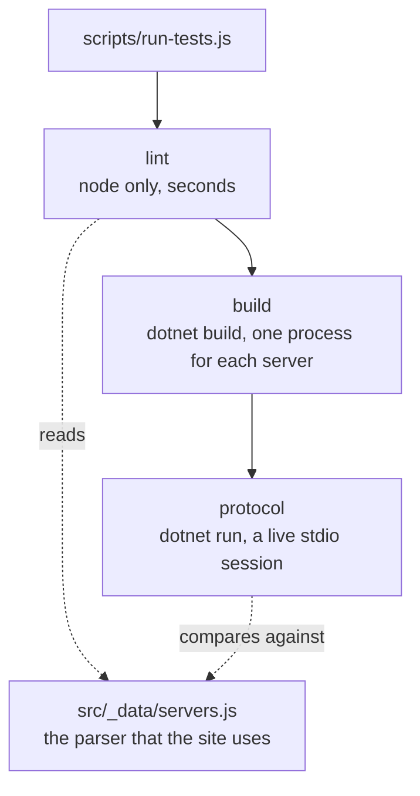
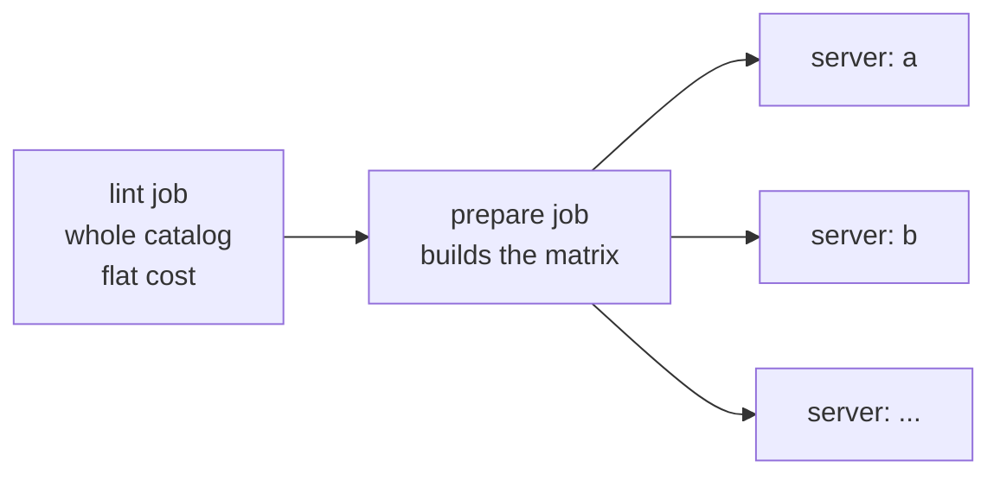

# Automated Testing

The harness in `test/` proves that each file in `mcp/` is correct, and that the catalog page tells the
truth about it. `scripts/run-tests.js` is the only entry point. GitHub Actions runs the same commands.

## The three layers



| Layer | File | Needs .NET | Answers |
|---|---|---|---|
| lint | `test/lint.test.js` | no | Is the metadata correct, and does the file follow the rules? |
| build | `test/build.test.js` | yes | Does the file compile, with no warning? |
| protocol | `test/protocol.test.js` | yes | Does the server speak MCP, and does the page agree with it? |

The layers run in this order. Lint is first because it costs about one second and needs no toolchain.

## Commands

```bash
npm test                                    # all layers, whole catalog
npm run test:lint                           # one layer
npm run test:protocol -- --server xquik     # one server
npm run test:list                           # the server ids, as JSON
node scripts/run-tests.js --jobs 4          # more parallel dotnet work
```

`run-tests.js` puts the server filter in the environment of the child process, and not in a shell
prefix. `DEBUG=x cmd` works in bash and fails in PowerShell, the shell of the main developer.

## Zero-touch discovery

A new server needs **no** change to a test file, to the workflow, or to any configuration. Add
`mcp/foo.cs`, and all three layers find it. `test/lib/catalog.js` calls the 11ty data function
`src/_data/servers.js`, which reads the directory itself.

The one optional file is `test/overrides.json`. It exists only when a server needs a value to start:

```json
{ "some-server": { "env": { "SOME_KEY": "dummy" }, "startupTimeoutMs": 120000, "buildTimeoutMs": 600000 } }
```

A server that the file does not name uses the defaults. An entry here is a visible exception, and not
a silent skip.

## What the lint layer checks

Per server: the front matter parses; `id` equals the file name stem; `name` equals `{id}.cs`;
description, tags, and version are set; `status` is a known value; no unknown front matter field;
`#:property PublishAot=false` is present; each `#:package` pins an exact version;
`LogToStandardErrorThreshold` is configured; each tool has a description; each name in `envVars` is
read with `GetEnvironmentVariable`, and each variable that the code reads is in `envVars`; no secret
looks hard coded.

Two checks are relational, and always use the **whole** catalog, because a filtered subset cannot show
a conflict:

- Each `id` is unique.
- One package never has two versions across the catalog.

### The check that finds a page that lies

The site reads the tool list from the source text with `extractToolsFromCSharp()`. That scan needs the
attribute and its `Description` on one line, and a `public static` signature within 10 lines below. A
tool that breaks these rules works at run time but **disappears from the page**.

Lint compares the count of `[McpServerTool` in the file with the count that the parser returns. The
protocol layer then compares the parser list against the list on the wire. Together they catch a page
that shows a wrong tool list.

## What the protocol layer proves

For each server it starts `dotnet run <file> -v q`, and sends `initialize`,
`notifications/initialized`, and `tools/list`:

- The server answers `initialize` with protocol version `2025-06-18`, and with a `serverInfo` name.
- Standard output holds **only** JSON-RPC messages. Any other line fails the test.
- `tools/list` returns at least one tool. Zero tools with a healthy handshake is the signature of AOT
  compilation removing the metadata that `WithToolsFromAssembly()` needs.
- Each tool on the wire has a description.
- The tool list on the page and the tool list on the wire hold the same number of tools, and the same
  names after normalization.
- The server stops when input closes.

### Names differ between the page and the wire

The C# SDK converts the method name to snake case. The catalog page shows the C# method name.

| In the file | On the page | On the wire |
|---|---|---|
| `GeneratePassword` | `GeneratePassword` | `generate_password` |

The comparison therefore removes case, `_`, and `-` before it compares. It still finds a tool that is
missing or extra.

### Startup must need no secret

The protocol layer **deletes every variable in every `envVars` list** from the environment before it
starts a server. A catalog server must list its tools with an empty environment, because that is what a
user gets after pasting the file. A key is needed only when the LLM calls the tool.

This also lets a pull request from a fork run the full harness, because the workflow gives no secret to
code that nobody has reviewed yet. `xquik` runs in CI like every other server.

## The client contract

`test/lib/mcp-client.js` holds two rules that are easy to get wrong:

1. **Input stays open for the whole session.** When standard input reaches end of file, the .NET host
   shuts down at once, and a reply still in the buffer is lost. A correct server then looks broken.
   Input closes only in `close()`. The manual recipe in
   [server authoring](mcp-server-authoring.md) uses a `sleep` for the same reason.
2. **A line that is not a JSON-RPC message goes to `strayStdout`.** That array is the proof that
   nothing damaged the protocol stream.

Standard error is collected apart, and is added to every failure message. A failed tool call on stdout
says only `An error occurred invoking '<tool>'`; the exception is on stderr.

## Cost as the catalog grows



`.github/workflows/mcp-tests.yml` holds three jobs:

- **lint** - the whole catalog, always. The cost does not grow.
- **prepare** - prints the list of server ids to test. `scripts/ci-matrix.js` makes the choice, so that
  a developer can test the logic without a push:

  ```bash
  node scripts/ci-matrix.js --all
  node scripts/ci-matrix.js --only "xquik,image-utility"
  git diff --name-only main...HEAD | node scripts/ci-matrix.js --changed
  ```

  On a pull request it takes the ids from the changed `mcp/*.cs` files. When a shared file changes
  (`test/`, `scripts/`, `src/_data/`, `package.json`, the workflow), it takes every id, because the
  harness itself changed. On a push, or a manual run with no input, it takes every id.
- **server** - a matrix with one leg for each id, `fail-fast: false` and `max-parallel: 6`. Each leg
  builds and probes one server, with a NuGet cache.

`ci-matrix.js` always filters its answer against the catalog that exists now. A pull request that
deletes a server therefore gives an empty array, and not a leg for a file that is gone. The script uses
Node and not `jq`, because the workflow already installs Node.

A pull request that adds one server therefore compiles one server, and not the whole catalog.

An empty matrix skips the `server` job, and does not fail it. This happens when a pull request only
deletes a server file.

## Notes

- `dotnet build <file>.cs` writes nothing into the repository. Artifacts go to a user level cache, so
  `.gitignore` needs no entry.
- The build uses verbosity `m`, the quietest level that still prints warnings. A warning fails the
  build, because the user sees it on the first run. `ANYMCP_ALLOW_WARNINGS=1` turns this into a note.
- Environment settings: `ANYMCP_SERVERS`, `ANYMCP_JOBS` (default 2), `ANYMCP_ALLOW_WARNINGS`,
  `ANYMCP_BUILD_TIMEOUT_MS` (default 300000), `ANYMCP_PROTOCOL_TIMEOUT_MS` (default 300000).

Related: [Server authoring](mcp-server-authoring.md), [Front matter schema](front-matter-schema.md),
[Data pipeline](../site/data-pipeline.md), [Practices](../practices.md).
