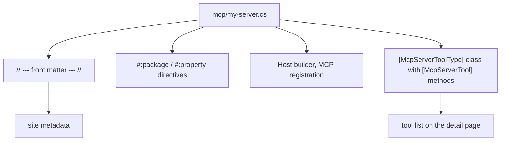

# Catalog Domain - Summary

The catalog is the set of `.cs` files in the `mcp/` directory. Each file is one complete MCP server, and
one entry on the site. A file has two parts: YAML front matter in C# comments, and the server code.

Topics in this domain:
- [Front matter schema](front-matter-schema.md) - the metadata fields and their defaults.
- [Server authoring](mcp-server-authoring.md) - how to write and test a new server.
- [Server inventory](server-inventory.md) - the servers that are in the catalog now.

Related: [Site data pipeline](../site/data-pipeline.md), [Practices](../practices.md).
