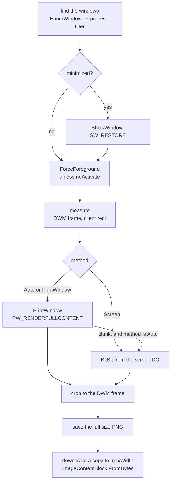

# Windows Window Capture

`mcp/win-app-screenshots.cs` copies the pixels of a window of a running Windows application into a
PNG. It gives the picture to the model, and writes the file to disk. This file holds the rules that
keep it correct, and that keep it a good catalog entry.

## The two tools

| C# name | Wire name | Answer |
|---|---|---|
| `ListAppWindows` | `list_app_windows` | `WindowListResult`, a JSON list of the windows that match |
| `CaptureAppWindow` | `capture_app_window` | `CallToolResult` with an image block and a text block |

A window comes from a process name, a process id, an executable path, or a part of the window title.
More than one window can match. The capture takes the first one, and the text block tells the model
to call `list_app_windows` to see them all.

## The capture flow



`Auto` is the default. `PrintWindow` needs no focus, and it works while another window covers the
target: a covered browser window gives its true pixels. `Screen` is the fallback, and it is exact for
what the eye sees, but it gives the window above the target when the target is behind another.

## No System.Drawing

The pixels come from raw P/Invoke, and ImageSharp makes the PNG. `System.Drawing.Common` is not an
option: it runs on Windows only, and a reference to it from a plain `net10.0` target makes CA1416
platform warnings. The build layer fails on a warning. See [practices](../practices.md).

`Native.Render` makes a 32 bit DIB with `CreateDIBSection`, runs a draw action against its device
context, and copies the bits out. `CreateDIBSection` gives the pixel pointer back, so no `GetDIBits`
call is necessary.

```csharp
var pixels = Native.Render(width, height, hdc => Native.PrintWindow(handle, hdc, flags));
var image = Image.LoadPixelData<Bgra32>(pixels, width, height);
```

## Invariants

- **The DIB is top-down.** `biHeight` holds the negative height. A positive height gives the rows in
  the other order, and the picture is upside down.
- **Alpha must become 255.** GDI leaves the alpha byte at zero. A `Bgra32` picture from those bytes
  is fully transparent. `Native.Render` makes each fourth byte 255 before it gives the array back.
- **`GdiFlush` comes before the read.** GDI holds the drawing in a batch. The memory of the DIB is
  correct only after the batch reaches the device context.
- **`PrintWindow` can lie.** It answers true and still gives an empty picture for some windows that
  draw with the graphics card. `IsBlank` samples a 24 by 24 grid of pixels; one colour only means
  empty. `Auto` then copies the display, and `PrintWindow` stops with an error.
- **The picture needs a cut.** `GetWindowRect` includes the invisible resize border of the
  compositor, which gives a grey edge. `DWMWA_EXTENDED_FRAME_BOUNDS` gives the true bounds, and the
  `PrintWindow` picture is cut to them. Both methods then give the same size.
- **DPI awareness comes before the first measurement.** Without
  `DPI_AWARENESS_CONTEXT_PER_MONITOR_AWARE_V2`, the coordinates are wrong on a display with a scale
  above 100 percent, and the picture is cut.

## The two rules that keep Linux CI green

The test harness builds and probes every server on `ubuntu-latest`. A Windows-only server must still
compile, start, and list its tools there.

1. **No native call while the host starts.** `Capture.PrepareProcess` sets the DPI awareness at the
   first tool call, and not at load time. A `DllImport` resolves at the first call, so a start away
   from Windows never touches `user32.dll`.
2. **Each tool starts with `Capture.RequireWindows`.** It throws a `PlatformNotSupportedException`.
   Only a call fails away from Windows, and never the handshake.

## The picture on the wire

`ImageContentBlock.Data` holds the **bytes of the base64 text**, and not the bytes of the picture.
Raw PNG bytes in that property reach the client as broken characters. Use the factory:

```csharp
ImageContentBlock.FromBytes(buffer.ToArray(), "image/png")
```

The file on disk keeps the full size. Only the copy for the model is made smaller, to `maxWidth`
pixels wide, with a default of 1400. This keeps the message small, and gives the user a usable PNG.

## Output path

The default file is `%TEMP%/win-app-screenshots/{process}-{yyyyMMdd-HHmmss}.png`. The code reads
`Path.GetTempPath()`, and not the `TEMP` variable: the lint layer asks that each variable that the
code reads with `GetEnvironmentVariable` is in the `envVars` list, and the page would then show an
`env` block that nobody must set.

An explicit `output` path is accepted anywhere. This server does **not** use the root directory rule
of `image-utility`, because that rule refuses the temp folder default.

## The origin

`scripts/Get-AppScreenshot.ps1` is the PowerShell script that this server comes from. It is not a
catalog entry, and the site does not read it. Keep the two in agreement, or delete the script.

Related: [Server inventory](server-inventory.md), [Server authoring](mcp-server-authoring.md),
[Automated testing](automated-testing.md), [Practices](../practices.md).
