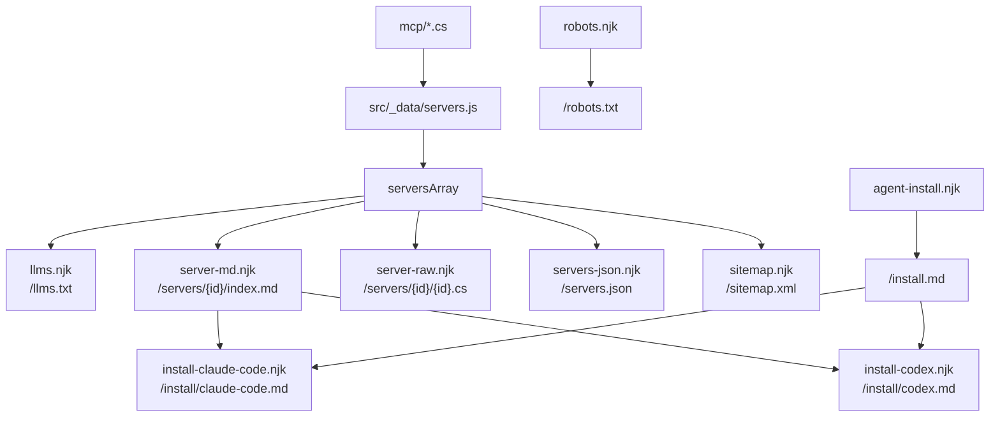

# Agent Endpoints

The site gives a second, machine-readable copy of the catalog. A coding agent reads these files
instead of the HTML, and installs a server with no help from a person.



## The endpoints

| URL | Template | Holds |
|---|---|---|
| `/llms.txt` | `src/llms.njk` | the index. One line for each server, and a link to each `.md`. |
| `/install.md` | `src/agent-install.njk` | the procedure that is the same for every server and every client. |
| `/install/claude-code.md` | `src/install-claude-code.njk` | the client procedure for Claude Code. |
| `/install/codex.md` | `src/install-codex.njk` | the client procedure for Codex. |
| `/servers/{id}/index.md` | `src/server-md.njk` | the values of one server, and links to the client pages. |
| `/servers/{id}/{id}.cs` | `src/server-raw.njk` | the source file, byte for byte. |
| `/servers.json` | `src/servers-json.njk` | the catalog as JSON, with a runnable argv and the default scope. |
| `/robots.txt` | `src/robots.njk` | allow all, and a pointer to `/llms.txt`. |
| `/sitemap.xml` | `src/sitemap.njk` | the HTML pages. |
| `/_headers` | `src/_headers` (passthrough) | the content type of the `.md` and `.cs` files. |

Each template is a `.njk` file with a `permalink`. `templateFormats` controls which input files
Eleventy finds, and not which output files it writes, so `.txt`, `.json`, and `.md` outputs need no
change to the configuration.

A `permalink` makes the output path, so `/install/codex.md` needs no directory in `src/`. The
`/*.md` rule in `src/_headers` uses a wildcard that also matches a path with a directory, so the two
client pages get `text/plain` with no new rule.

## Invariants

**The prose is Simplified Technical English.** `/llms.txt`, `/install.md`,
`/install/claude-code.md`, `/install/codex.md`, each `/servers/{id}/index.md`, the `runtime` strings
in `/servers.json`, and the agent prompt are procedures for a machine, so they obey ASD-STE100: one
instruction in one sentence, the imperative form, the active voice, the simple present tense, and one
meaning for one word. See [practices](../practices.md).

**One client, one page.** A client-specific instruction lives on the page of that client, and nowhere
else. `/install.md` holds the steps that are the same for every client, and a table that sends the
reader to the correct page. `/servers/{id}/index.md` holds the values of one server — the id, the
file, the command, and the argument list — and links to the two client pages. It holds no file shape.
The cost is one more fetch for an installing agent. The gain is that a change to one client touches
one file. See [MCP clients](mcp-clients.md).

**An agent asks which client the user has.** Two clients read two different files, and the wrong file
gives a client with no server and no error message. `/install.md` and `/servers/{id}/index.md` both
say to ask before they write a file.

**Each rule for an agent is on the page, and not in the prompt.** The **Copy Agent Prompt** button
gives one sentence: the task, and the URL of `/servers/{id}/index.md`. That page opens with a
`## Rules` list, which holds every rule that the prompt once carried — obey the page, use the shell
of the user, install into the current project, ask which client the user has, name each file before
you change it, and stay in the root directory. The agent reads the page before it writes a file, so
the same rule in two places is only a rule to change two times. See
[client-side behavior](client-side-behavior.md).

**A committed configuration holds no secret, in both formats.** Claude Code replaces `${KEY}` from
the environment. Codex replaces nothing: its `env` table holds literal text, so a Codex file uses
`env_vars = ["KEY"]`, and Codex sends the value from its own environment. `test/site.test.js` checks
both forms on the HTML page of each server that has an `envVars` list, and it fails on a literal
`env = {` table.

**Write `| safe` on every value.** These outputs are not HTML, and Nunjucks escapes by default. An
escaped `<` makes a `.cs` file that does not compile, and an escaped `"` makes JSON that does not
parse. The rule to review is simple: a non-HTML template holds no bare `{{ }}`.

The one place that must **not** have `| safe` is the `data-prompt` attribute, in `servers.njk` and
in `index.njk`. That
value goes into HTML, the escape is correct there, and `dataset` decodes it again.

**The raw endpoint uses `code`, and not `displayCode`.** `/servers/{id}/{id}.cs` is the catalog file,
byte for byte. `displayCode` cuts the front matter, trims the last newline, and decodes HTML entities,
so it cannot give the same bytes. The HTML page and the clipboard continue to use `displayCode`.
`test/site.test.js` compares a SHA-256 hash and fails if the two differ.

**Every URL is absolute.** An agent reads these files with no base URL, so a relative link is dead.
Use `site.url` from `src/_data/site.json`.

**The default install is a project install.** The instructions put the server file in
`.mcp-servers/` in the project of the user, and the configuration in the file of the client in that
same project. The path in the argument list is therefore relative, `./.mcp-servers/{id}.cs`, which is
correct for each person who clones the project, and on each operating system. A relative path also
needs no Windows backslash, so no snippet on the site doubles a backslash any more.

An install for the user comes last on each client page, and needs an absolute path. An agent must not
choose it without a request from the user. `test/site.test.js` checks that `--scope project` comes
before `--scope user` on `/install/claude-code.md`. `codex mcp add` is the same fallback for Codex,
and it is the wrong command for a project install, because it writes the personal
`~/.codex/config.toml` of the user.

**Every install snippet holds `-v` and `q`.** They are two array elements, and not one element
`"-v q"`. Standard output carries the JSON-RPC stream, and without the flag the build output can reach
that stream and break the connection.

**Tool names appear in both forms.** The SDK converts a C# method name to snake case, so a
`tools/list` response holds `generate_password` where the page shows `GeneratePassword`. The
`wireName` filter in `.eleventy.js` makes the first form. See
[automated testing](../catalog/automated-testing.md).

## The end state that an agent can reach

An agent that installs a server cannot restart the client it runs inside, cannot approve a project
server for a person, and cannot write a file of the user. So the pages give it a success condition
that it can reach by itself, and name the conditions that look like a failure and are not:

- **`Pending approval` is success, in Claude Code.** `claude mcp add` writes `.mcp.json`, and Claude
  Code connects the server only after a person approves it. The pages say to stop there, and to ask
  the user to restart the client and approve, or to run `/mcp`. A page that asks for a `connected`
  status instead names a condition that an installing agent can never see, and the agent then retries
  the registration.
- **A written `.codex/config.toml` is success, in Codex.** The two steps that remain belong to the
  user: the trust entry in the personal `~/.codex/config.toml`, and a restart with a new chat. An
  agent gives the user those lines and stops. See [MCP clients](mcp-clients.md).
- **A silent build is success.** `dotnet build ... -v q` prints nothing and exits 0. There is no
  `Build succeeded` line to look for.
- **No stdio smoke test.** JSON-RPC lines that are piped in one block give no output, because
  standard input reaches the end of the file before the host answers `initialize`. The log line is
  `transport completed reading messages`. The first client start is the test.
- **`claude mcp add` writes `"env": {}`.** The file therefore does not match the JSON snippet on the
  page byte for byte. The pages say the two forms are equivalent, so an agent does not "correct" it.

Two more rules keep an agent from making a wrong command:

- **Every step repeats the working directory.** All paths are relative to the project root. An agent
  that moves into `.mcp-servers/` to read a file builds `.mcp-servers/.mcp-servers/...` on the next
  step. Each command block says which directory it runs in.
- **The SDK check is `dotnet --list-sdks`.** `dotnet --version` gives the SDK that is selected now,
  and a `global.json` file can select an SDK before 10 on a machine that also has 10. The
  requirement is 10 **or later**: 11 and later are correct. `/servers.json` holds the same check in
  `runtime.check`, and the end-state rule of each client in `runtime.clients[].postInstall`.

## The two filters

`.eleventy.js` holds two filters for these endpoints, `wireName` and `serversManifest`.
`serversManifest` builds the whole
`/servers.json` body in JavaScript, and the template prints the string. JSON that a template writes by
hand breaks on the first description that holds a quote. This follows `displayCodeMap`, which works
the same way.

`serversManifest` drops `code` and `displayCode`, which are larger than all other fields together, and
it adds a `run` block:

```json
"run": {
  "command": "dotnet",
  "args": ["run", "./.mcp-servers/xquik.cs", "-v", "q"],
  "cwd": "the project directory"
}
```

A program that reads the manifest therefore cannot build an argv that loses `-v q`, and it needs no
path substitution, because the path is the one that the default install makes. The `run` block is the
same for each client, because the two clients start the same file with the same command.

`runtime.clients` holds the part that is not the same. One entry for each client gives the
configuration file, the format, the page, and the end state:

```json
"clients": [
  {
    "id": "codex",
    "label": "Codex",
    "configFile": ".codex/config.toml in the project root",
    "format": "toml",
    "docs": "https://anymcp.net/install/codex.md",
    "postInstall": "Codex reads a project configuration file only from a trusted project..."
  }
]
```

`runtime` holds no `configFile` key and no `postInstall` key any more. Those two values are different
for each client, and a program that reads the old keys got the Claude Code answer for every client.

## Discovery

Three paths lead an agent to these files:

- `/llms.txt`, which is the entry point that the llmstxt.org convention defines.
- A `link rel="alternate"` in `base.njk` on every page. `servers.njk` sets `agentMarkdown` in its
  `eleventyComputed` block, and `base.njk` writes the link when the value exists.
- The **Copy Prompt** button on each catalog card, and **Copy Agent Prompt** on each server page.
  It is the primary button in both places. See
  [client-side behavior](client-side-behavior.md).

## Content types

Cloudflare Pages sets the content type from a file extension, and then applies `_headers`, so a rule
in that file wins. Without a rule, a `.cs` file has no entry and becomes
`application/octet-stream`, which a browser downloads and some agent fetchers refuse. The rules give
`text/plain; charset=utf-8` to `.md` and `.cs`.

Do not add a CORS header. Pages sends `access-control-allow-origin: *` on each asset already.

Related: [MCP clients](mcp-clients.md), [Templates and layouts](templates-and-layouts.md),
[Data pipeline](data-pipeline.md), [Build and deploy](build-and-deploy.md),
[Automated testing](../catalog/automated-testing.md).
