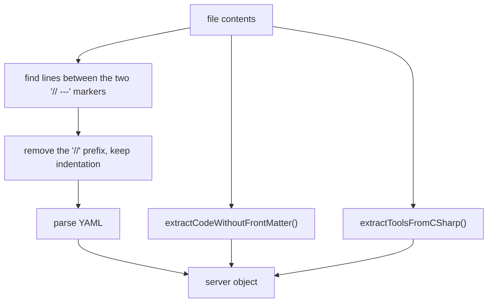

# Data Pipeline

`src/_data/servers.js` reads the catalog. `src/_data/serversArray.js` adapts it for pagination.

## Discovery

`servers.js` resolves the catalog directory relative to its own file:

```javascript
const mcpDir = join(__dirname, '../../mcp');
const files = readdirSync(mcpDir).filter(f => extname(f) === '.cs');
```

The path goes up from `src/_data/` to the repository root, and then into `mcp/`. Any `.cs` file in
`mcp/` becomes a catalog entry. The function catches all read errors, prints a warning, and returns an
empty object. The build therefore does not stop if `mcp/` is absent.

## Parse steps



`parseCSharpMcpServer()` builds the object. It gives a default to every field:

```javascript
const server = {
  id: metadata.id || filename,
  name: metadata.name || `${filename}.cs`,
  description: metadata.description || 'MCP Server',
  longDescription: metadata.longDescription || metadata.description || 'MCP Server',
  tags: Array.isArray(metadata.tags) ? metadata.tags : (metadata.tags ? [metadata.tags] : []),
  status: metadata.status || 'stable',
  downloads: metadata.downloads || 0,
  lastUpdated: metadata.lastUpdated || <today>,
  version: metadata.version || '1.0.0',
  author: metadata.author || 'Unknown',
  license: metadata.license || 'MIT',
  createdDate: metadata.createdDate || metadata.lastUpdated || <today>,
  envVars: metadata.envVars || [],
  tools: tools,
  code: contents,
  displayCode: codeWithoutFrontMatter
};
```

## Tool extraction

`extractToolsFromCSharp()` scans the source line by line. It looks for a line that holds both
`[McpServerTool` and `Description(`. It then reads up to 10 lines forward for a line that holds
`public static` and `(`, and takes the method name from it.

```csharp
[McpServerTool, Description("Get the current date and time")]
public static string GetCurrentDateTime() => DateTime.Now.ToString("O");
```

This gives `{ name: "GetCurrentDateTime", description: "Get the current date and time" }`.

Constraints:
- The attribute and its `Description` must be on one line.
- The tool method must be `public static`.
- If the method is more than 10 lines below the attribute, the parser does not find the tool.

## Code extraction

`extractCodeWithoutFrontMatter()` returns all text after the second `// ---` line. If the file has no
front matter, it returns the full text. The function then decodes `&quot;`, `&#39;`, `&lt;`, `&gt;`,
and `&amp;`. This protects the code from HTML entity damage that happens when the code passes through
the template layer.

## Array adapter

11ty pagination needs an array, but `servers` is an object. `serversArray.js` calls `servers()` again,
and maps the entries:

```javascript
return Object.entries(serversData).map(([key, value]) => ({ id: key, ...value }));
```

Invariant: `serversArray[n].id` is always the object key, and not the `id` field of the front matter.
These two values are the same, because `servers.js` uses `server.id` as the key.

Note: the parser runs two times for each build, one time for `servers` and one time for `serversArray`.
The catalog is small, so this cost is acceptable.

Related: [Front matter schema](../catalog/front-matter-schema.md),
[Templates and layouts](templates-and-layouts.md).
