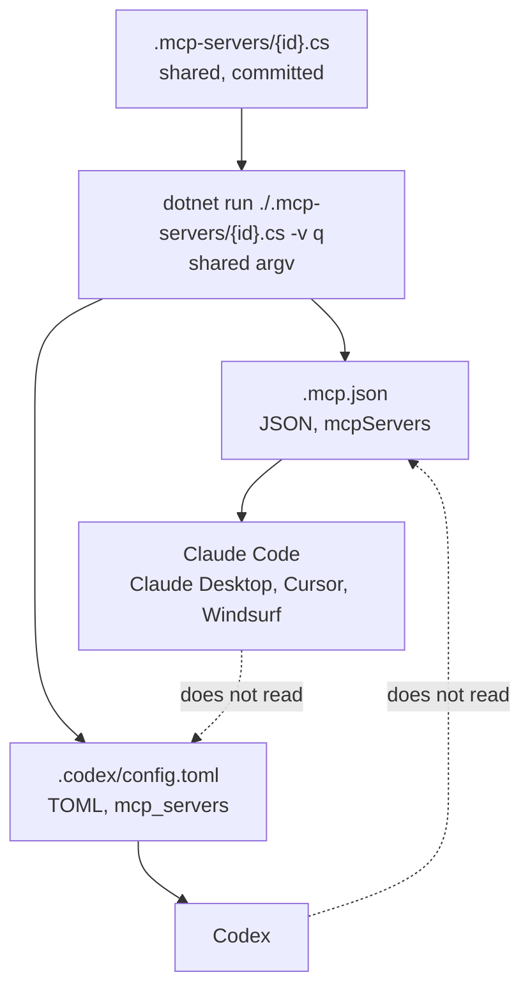

# MCP Clients

The catalog supports two MCP clients: Claude Code and Codex. They start the same server file with
the same command, and they agree on nothing else. Read this file before you change an install page.

## What the two clients share, and what they do not



| Item | Claude Code | Codex |
|---|---|---|
| Configuration file | `.mcp.json` in the project root | `.codex/config.toml` in the project root |
| Format | JSON | TOML |
| Key | `mcpServers` | `mcp_servers` |
| Server file | `.mcp-servers/{id}.cs` | the same file |
| Argument list | `["run", "./.mcp-servers/{id}.cs", "-v", "q"]` | the same four elements |
| Start limit | `MCP_TIMEOUT` in the environment | `startup_timeout_sec` in the file |
| Secret in a committed file | `"env": { "KEY": "${KEY}" }` | `env_vars = ["KEY"]` |
| Gate before the server connects | a person approves the project server | the project has a trust entry |
| CLI that writes the project file | `claude mcp add --scope project` | none |
| CLI for a user install | `claude mcp add --scope user` | `codex mcp add` |

**The two formats are not interchangeable.** A `mcpServers` key in `.codex/config.toml` gives no
server, and gives no error message. This is the failure that an agent makes most easily, so each
page says it.

## Claude Code

```json
{
  "mcpServers": {
    "generate-password": {
      "type": "stdio",
      "command": "dotnet",
      "args": ["run", "./.mcp-servers/generate-password.cs", "-v", "q"],
      "env": {}
    }
  }
}
```

Claude Code replaces `${KEY}` with the value from the environment when it reads the file, so a
committed file names a variable and holds no value.

`claude mcp add <id> --scope project -- ...` writes the same entry. The `--` separator is necessary.
The command writes an empty `"env": {}` block, and that block is the same as a file with no `env`
key. An agent must not "change" it.

Visual Studio and VS Code read JSON with the key `servers` in place of `mcpServers`. The object in
the key is the same, so they belong on the Claude Code page.

## Codex

```toml
[mcp_servers.generate-password]
command = "dotnet"
args = [
    "run",
    "./.mcp-servers/generate-password.cs",
    "-v",
    "q",
]
startup_timeout_sec = 60
```

Three conditions are all necessary. Two of them are outside the project:

1. **The project file.** `.codex/config.toml` holds the `[mcp_servers.<id>]` table. It is committed.
2. **The trust entry.** Codex loads a project configuration file only from a trusted project. The
   entry goes in the personal `~/.codex/config.toml` of the user:

   ```toml
   [projects.'C:\Users\USERNAME\path\to\repository']
   trust_level = "trusted"
   ```

   Without it, Codex ignores `.codex/config.toml` and gives no error message. The entry names a
   directory of one computer, so it is not committed, and an agent must not write it.
3. **A restart, and a new chat.** Codex reads the configuration when it starts. An old chat keeps the
   old server list.

**The Windows path trap.** The trust key must hold the normal absolute path. The extended Windows
form `\\?\C:\...` can be different from the workspace path, and Codex then ignores the project file.
The two failures look the same, so the pages name the trap beside the trust entry.

**Codex replaces no variable.** The `env` table holds literal text, so `${KEY}` in that table becomes
the six characters and not a value. `env_vars = ["KEY"]` names a variable, and Codex sends the value
from its own environment to the server. This keeps the invariant that a committed configuration holds
no secret. See [agent endpoints](agent-endpoints.md).

**`codex mcp add` is not the project install.** It writes the personal `~/.codex/config.toml` of the
user. The project then has two sources of truth: a committed file that Codex ignores, and a personal
file that operates. It stays on the page as the user-scope fallback only, beside
`claude mcp add --scope user`.

## The end state that an agent can reach

An agent cannot start the client that contains it, and it cannot write a file of the user. So each
client page names a stop point that an agent reaches by itself:

- **Claude Code**: `claude mcp add` reports `Pending approval`. That is success. The agent stops, and
  asks the user to start Claude Code again and approve the server.
- **Codex**: `.codex/config.toml` exists and holds the server. That is success. The agent stops, and
  gives the user the two steps that remain: the trust entry, and a restart with a new chat.

A page that asks for a `connected` status instead names a condition that an installing agent never
sees, and the agent then does the registration again.

## Where the client knowledge lives

One client gets one page. A client-specific instruction goes on that page, and nowhere else:

| File | Holds |
|---|---|
| `src/agent-install.njk` → `/install.md` | the SDK check, the download, the build, and the client table. No file shape. |
| `src/install-claude-code.njk` → `/install/claude-code.md` | everything above for Claude Code. |
| `src/install-codex.njk` → `/install/codex.md` | everything above for Codex. |
| `src/server-md.njk` → `/servers/{id}/index.md` | the values of one server, and links to the two client pages. |
| `.eleventy.js`, `runtime.clients` in `serversManifest` | the same table, for a program. |

The pages for a person, `src/setup.njk` and `src/servers.njk`, show both shapes together. A person
chooses on the page and needs no second fetch, so the duplication is correct there.

To add a third client, add one template with a `permalink` under `/install/`, one row to the table on
`/install.md` and on `/servers/{id}/index.md`, one entry to `runtime.clients`, one block to the two
HTML pages, and one test group in `test/site.test.js`.

Related: [Agent endpoints](agent-endpoints.md), [Templates and layouts](templates-and-layouts.md),
[Practices](../practices.md), [Server authoring](../catalog/mcp-server-authoring.md).
