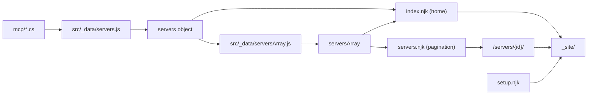

# Site Domain - Summary

The site is an Eleventy (11ty) static site. Input is `src/`. Output is `_site/`. The build reads the
`.cs` files in `mcp/`, and makes three kinds of page: the home page, one detail page for each server,
and a setup guide.

Topics in this domain:
- [Data pipeline](data-pipeline.md) - how `.cs` files become page data.
- [Templates and layouts](templates-and-layouts.md) - the template hierarchy and the pages.
- [Styling](styling.md) - Tailwind theme, fonts, and code colors.
- [Client-side behavior](client-side-behavior.md) - search, copy, download, and toast.
- [Build and deploy](build-and-deploy.md) - commands, configuration, and hosting.

Related: [Catalog domain](../catalog/summary.md), [Practices](../practices.md).
