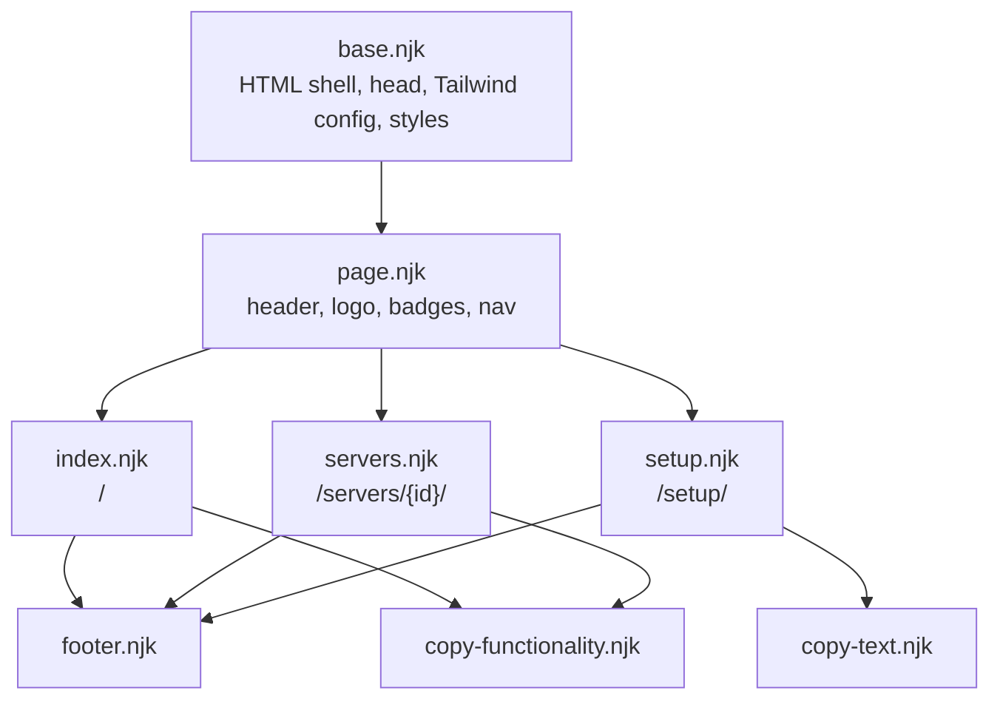

# Templates and Layouts

All templates use Nunjucks. Layouts are in `src/_includes/`. Pages are in `src/`.



Nine more templates make the machine-readable output. They use no layout, because their output is
not HTML: `llms.njk`, `agent-install.njk`, `install-claude-code.njk`, `install-codex.njk`,
`server-md.njk`, `server-raw.njk`, `servers-json.njk`, `robots.njk`, and `sitemap.njk`. See
[agent endpoints](agent-endpoints.md).

## base.njk

`base.njk` holds the full HTML document. It sets the title as `{{ title }} - {{ site.title }}`. It
loads the fonts, Tailwind, Plausible analytics, and Prism.js from CDNs. It holds the Tailwind theme
configuration and all custom CSS. See [styling](styling.md).

## page.njk

`page.njk` adds the sticky header. Two page variables control the header:

- `showBadges` - shows the version badges from `site.badges`, and the GitHub star button.
- `showNavigation` - shows the "Setup" link and the "Submit" button.

Only the home page sets both variables to `true`.

## index.njk

`index.njk` shows the hero section, the search box, and the card grid. The template writes the card
markup inline in a `` loop. Each card carries the search index in a
data attribute:

```html
<div ... data-server="{{ server.name }} {{ server.description }} {{ server.tags | join(' ') }}">
```

A card gives two buttons: **View**, which opens the detail page, and **Copy Prompt**, which is the
primary one. A card copies no source code. The code belongs to the detail page, which shows the
block that the copy buttons read. See [client-side behavior](client-side-behavior.md).

## servers.njk

`servers.njk` makes one page for each server through 11ty pagination:

```yaml
pagination:
  data: serversArray
  size: 1
  alias: serverData
permalink: "/servers/{{ serverData.id }}/"
eleventyComputed:
  title: "{{ serverData.name }}"
  description: "{{ serverData.description }}"
```

`servers.njk` also sets `agentMarkdown` in `eleventyComputed`. `base.njk` reads it, and writes a
`link rel="alternate"` that points at the markdown copy of the page.

The page shows the description, a status badge when the status is not `stable`, the tags, the tool
list, the source code with copy, download, and agent-prompt buttons, two ready configuration
snippets, and a metadata sidebar.

The two snippets are the `.mcp.json` shape for Claude Code and the `.codex/config.toml` shape for
Codex. A person chooses a client on the page, so both shapes are here, and the page needs no second
fetch. The JSON snippet adds an `env` block when `serverData.envVars` is not empty, and the TOML
snippet adds an `env_vars` list for the same servers. A note beside the JSON snippet says that Visual
Studio and VS Code use `servers` in place of `mcpServers`. A note beside the TOML snippet gives the
Codex trust entry and the Windows path trap. The argument list ends with `"-v"` and `"q"` in both
snippets, and each snippet on the site must keep them. See [MCP clients](mcp-clients.md).

Invariant: the page prints `serverData.displayCode`, and not `serverData.code`. The front matter must
not appear on the page or in the clipboard. The raw endpoint `/servers/{id}/{id}.cs` is different: it
prints `serverData.code`, byte for byte, and `test/site.test.js` compares a hash.

## setup.njk

`setup.njk` is a static guide. It explains how to install .NET 10, how to save a server file,
and how to configure the LLM client. Like `servers.njk`, it gives both client shapes together. It
uses `copy-text.njk` for its command examples, and each snippet has its own copy button.

## Shared components

- `footer.njk` - the site footer. All three pages include it.
- `copy-functionality.njk` - copy and download scripts. See [client-side behavior](client-side-behavior.md).
- `copy-text.njk` - a `copyBlock(button)` helper for the setup page. It copies the code block that
  the button belongs to, so each snippet exists one time.

Related: [Data pipeline](data-pipeline.md), [Styling](styling.md), [MCP clients](mcp-clients.md).
